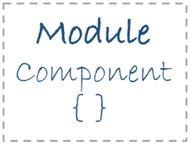

> 内容纲要
>
> - 了解 Angular 核心特性（概念模型）


本章节主要为大家描述 Angular **“概念模型”**（ Mental Model ）的构建。我发现，很多开发者已经做过非常多的项目，但是当你跟他聊的时候，你很快就会发现他并没有掌握这门框架的精髓。打几个比方，当别人提到 Spring 的时候，你的大脑里面第一个想到一定是 DI、IOC、AOP 这些东西；当别人提到 Hibernate 或者 Mybatis 的时候，你的大脑里面立即会浮现出 ORM 的概念；当别人提到 React 的时候，你想到的应该是 VDom、JSX；当别人提到 jQuery 的时候，你首先想到的应该是$对吧？所以，你可以看到，任何一个成功的框架都有自己独创的 **“概念模型”**，或者叫 **“核心价值”** 也可以。这是框架本身存在的价值，也是你掌握这门框架应该紧扣的主线，而不是上来就陷入到茫茫多的技术细节里面去。


## 组件（Components）

既然如此，问题就来了，新版本的 Angular 的核心概念是什么呢？

非常简单，一切都是围绕着“组件”（ Component ）的概念展开的：


Component（组件）是整个框架的核心，也是终极目标。“组件化”的意义有2个：

- 第一是分治，因为有了组件之后，我们可以把各种逻辑封装在组件内部，避免混在一起
- 第二是复用，封装成组件之后不仅可以在项目内部复用，而且可以沉淀下来跨项目复用

## 模块（Modules）



NgModule（模块）是组织业务代码的利器，按照你自己的业务场景，把组件、服务、路由打包到模块里面，形成一个个的积木块，然后再用这些积木块来搭建出高楼大厦。


## 模板（Templates）

组件是用来封装对视图的操作的，而我们的所谓的视图其实也就是常规的 HTML 模板：

```html
<!--The content below is only a placeholder and can be replaced.-->
<div style="text-align:center">
  <h1>
    Welcome to {{ title }}!
  </h1>
</div>
```


## 元数据（Metadata）


元数据告诉 Angular 如何处理组件类。

```typescript
@Component({
  selector: 'app-root',
  templateUrl: './app.component.html',
  styleUrls: ['./app.component.css']
})
export class AppComponent {
  title = '你的第一个 Angular 应用';
}
```

## 数据绑定（Data binding）


和 Vue.js 一样，MVVM 思想（数据驱动视图），通过特殊的 `{{}}` 语法将数据绑定到 DOM 元素，当数据改变的时候会影响视图的更新。

## 指令（Directives）


和 Vue.js 一样，Angular 扩展了 HTML 语法，增加了一些特殊的属性指令，例如：

- `*ngFor` 循环指令
- `*ngIf` 条件判断指令
- `[(ngModel)]` 表单控件双向绑定指令
- ...

## Services（服务）


服务是一个广义范畴，包括：值、函数，或应用所需的功能。

说白了服务就是针对某个单一或系统功能的封装，例如在 Angular 核心包里面，最典型的一个服务就是 Http 服务。

几乎任何东西都可以是一个服务。 典型的服务是一个类，具有专注的、明确的用途。它应该做一件特定的事情，并把它做好。

例如：

- 日志服务
- 和服务端接口交互的服务

组件类应保持精简。组件本身不从服务器获得数据、不进行验证输入，也不直接往控制台写日志。 它们把这些任务委托给服务。

服务仍然是任何 Angular 应用的基础。组件就是最大的服务消费者。

组件的任务就是提供用户体验，仅此而已。它介于视图（由模板渲染）和应用逻辑（通常包括*模型*的某些概念）之间。 设计良好的组件为数据绑定提供属性和方法，把其它琐事都委托给服务。

Angular 不会*强制要求*我们遵循这些原则。 即使我们花 3000 行代码写了一个“厨房洗碗槽”组件，它也不会抱怨什么。

## 依赖注入（Dependency injection）


“依赖注入”是提供类的新实例的一种方式，还负责处理好类所需的全部依赖。大多数依赖都是服务。 Angular 使用依赖注入来提供新组件以及组件所需的服务。

## 总结

我们学到的这些只是关于 Angular 应用程序的八个主要构造块的基础知识：

- [模块](https://angular.cn/guide/architecture#modules)
- [组件](https://angular.cn/guide/architecture#components)
- [模板](https://angular.cn/guide/architecture#templates)
- [元数据](https://angular.cn/guide/architecture#metadata)
- [数据绑定](https://angular.cn/guide/architecture#data-binding)
- [指令](https://angular.cn/guide/architecture#directives)
- [服务](https://angular.cn/guide/architecture#services)
- [依赖注入](https://angular.cn/guide/architecture#dependency-injection)

这是 Angular 应用程序中所有其它东西的基础，要使用 Angular，以这些作为开端就绰绰有余了。 但它仍然没有包含我们需要知道的全部。

这里是一个简短的、按字母排序的列表，列出了其它重要的 Angular 特性和服务。

- 动画
- 表单
- HTTP
- 组件生命周期
- 管道过滤器
- 路由
- 测试

