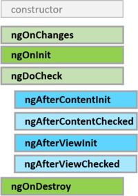

几乎所有前端框架都在玩“组件化”，而且最近都不约而同地选择了“标签化”这种思路，Angular 也不例外。

对新版本的 Angular 来说，一切都是围绕着“组件化”展开的，组件是 Angular 的核心概念模型。


## 组件的定义

以下是一个最简单的 Angular 组件定义：

```javascript
import { Component } from '@angular/core';

@Component({
  selector: 'app-root',
  templateUrl: './app.component.html',
  styleUrls: ['./app.component.css']
})
export class AppComponent {
  title = 'itcast';
}

```

- `@Component`：这是一个 Decorator（装饰器），其作用类似于 Java 里面的注解。Decorator 这个语言特性目前（2017-10）处于 Stage 2（草稿）状态，还不是 ECMA 的正式规范。
- `selector`：组件的标签名，外部使用者可以这样来使用这个组件：<app-root>。默认情况下，ng 命令生成出来的组件都会带上一个 app 前缀，如果你不喜欢，可以在 angular-cli.json 里面修改 prefix 配置项，设置为空字符串将会不带任何前缀。
- `templateUrl`：引用外部的 HTML 模板。如果你想直接编写内联模板，可以使用 template，支持 ES6 引入的[“模板字符串”写法](http://es6.ruanyifeng.com/#docs/string)。
- `styleUrls`：引用外部 CSS 样式文件，这是一个数组，也就意味着可以引用多份 CSS 文件。
- `export class AppComponent`：这是 ES6 里面引入的模块和 class 定义方式。


## 组件的模板

- 内联模板
- 模板文件

你可以在两种地方存放组件模板。 你可以使用`template`属性把它定义为*内联*的，或者把模板定义在一个独立的 HTML 文件中， 再通过`@Component`装饰器中的`templateUrl`属性， 在组件元数据中把它链接到组件。

无论用哪种风格，模板数据绑定在访问组件属性方面都是完全一样的。

具体模板语法请参考：[模板语法](#/template-syntax)

## 组件通信

> 参考官方文档：https://angular.io/guide/component-interaction

组件就像零散的积木，我们需要把这些积木按照一定的规则拼装起来，而且要让它们互相之间能进行通讯，这样才能构成一个有机的完整系统。

在真实的应用中，组件最终会构成树形结构，就像人类社会中的家族树一样：


在树形结构里面，组件之间有几种典型的关系：父子关系、兄弟关系、没有直接关系。

相应地，组件之间有以下几种典型的通讯方案：

- 直接的父子关系：父组件直接访问子组件的 public 属性和方法。
- 直接的父子关系：借助于 @Input 和 @Output 进行通讯
- 没有直接关系：借助于 Service 单例进行通讯。
- 利用 cookie 和 localstorage 进行通讯。
- 利用 session 进行通讯。

无论你使用什么前端框架，组件之间的通讯都离开不以上几种方案，这些方案与具体框架无关。

### 父子通信：Input Down

> 参考文档：https://angular.io/guide/component-interaction#pass-data-from-parent-to-child-with-input-binding

1. 父组件通过子组件标签传递属性
2. 子组件在内部声明 `@Input` 接收

- Input 是单向的
  - 父组件如果把数据改了，子组件也会更新
  - 但是反之不会
  - 有一个例外，引用类型修改

下面是一个示例：

子组件：

```typescript
import { Component, Input } from '@angular/core';
 
import { Hero } from './hero';
 
@Component({
  selector: 'app-hero-child',
  template: `
    <h3>{{hero.name}} says:</h3>
    <p>I, {{hero.name}}, am at your service, {{masterName}}.</p>
  `
})
export class HeroChildComponent {
  // 声明接收父组件传递的数据
  @Input() hero: Hero;
  @Input('master') masterName: string; // 接收 master 重命名为 masterName
}
```

父组件：

```typescript
import { Component } from '@angular/core';
 
import { HEROES } from './hero';
 
@Component({
  selector: 'app-hero-parent',
  template: `
    <h2>{{master}} controls {{heroes.length}} heroes</h2>
	<!-- 在子组件标签上传递数据 -->
    <app-hero-child *ngFor="let hero of heroes"
      [hero]="hero"
      [master]="master">
    </app-hero-child>
  `
})
export class HeroParentComponent {
  heroes = HEROES;
  master = 'Master';
}
```

### 父子通信：Output Up

> 参考文档：https://angular.io/guide/component-interaction#parent-listens-for-child-event

`@Output` 的本质是事件机制，我们可以利用它来订阅子组件上发布的事件，子组件上这样写：

```typescript
import { Component, EventEmitter, Input, Output } from '@angular/core';
 
@Component({
  selector: 'app-voter',
  template: `
    <h4>{{name}}</h4>
    <button (click)="vote(true)"  [disabled]="voted">Agree</button>
    <button (click)="vote(false)" [disabled]="voted">Disagree</button>
  `
})
export class VoterComponent {
  @Input()  name: string;
  @Output() onVoted = new EventEmitter<boolean>();
  voted = false;
 
  vote(agreed: boolean) {
    this.onVoted.emit(agreed); // 传递的数据就是事件对象
    this.voted = true;
  }
}
```

在父组件中订阅处理：

```typescript
import { Component }      from '@angular/core';
 
@Component({
  selector: 'app-vote-taker',
  template: `
    <h2>Should mankind colonize the Universe?</h2>
    <h3>Agree: {{agreed}}, Disagree: {{disagreed}}</h3>
    <app-voter *ngFor="let voter of voters"
      [name]="voter"
      (onVoted)="onVoted($event)">
    </app-voter>
	<!-- $event在这里是自定义事件对象，接收到的是子组件内部发布事件传递的数据 -->
  `
})
export class VoteTakerComponent {
  agreed = 0;
  disagreed = 0;
  voters = ['Mr. IQ', 'Ms. Universe', 'Bombasto'];
 
  onVoted(agreed: boolean) {
    agreed ? this.agreed++ : this.disagreed++;
  }
}
```

### 父子通信：父组件直接访问子组件 public 成员

> 参考文档：https://angular.io/guide/component-interaction#parent-interacts-with-child-via-local-variable

对于有直接父子关系的组件，父组件可以直接访问子组件里面 public 型的属性和方法，示例代码片段如下：

```html
<app-foo #child></app-foo>
<button (click)="child.increment()">调用子组件的方法</button>
```

显然，子组件里面必须暴露一个 public 型的 childFn 方法，就像这样：

```typescript
export class FooComponent implements OnInit {
  public message: string = 'foo message'
  public count: number = 0

  constructor() { }

  public increment (): void {
    this.count++
  }

  ngOnInit() {
  }
}
```

以上是通过在模板里面定义局部变量的方式来直接调用子组件里面的 public 型方法。在父组件的内部也可以访问到子组件的实例，需要利用到 @ViewChild 装饰器，示例如下：

```typescript
@ViewChild(ChildComponent)
private childComponent: ChildComponent;
```

关于 @ViewChild 在后面的内容里面会有更详细的解释。

很明显，如果父组件直接访问子组件，那么两个组件之间的关系就被固定死了。父子两个组件紧密依赖，谁也离不开谁，也就都不能单独使用了。所以，除非你知道自己在做什么，最好不要直接在父组件里面直接访问子组件上的属性和方法，以免未来一改一大片。

### 没有直接关系通信：Service 单例

> 参考文档：https://angular.io/guide/component-interaction#parent-and-children-communicate-via-a-service


### 利用 Cookie 和 localStorage 进行通信


### 利用 Session 进行通信


### 小结

组件间的通讯方案是通用的，无论你使用什么样的前端框架，都会面临这个问题，而解决的方案无外乎本文所列出的几种。

## 组件生命周期

> 参考文档：https://angular.io/guide/lifecycle-hooks




- ngOnChanges()
- ngOnInit()
  - 只执行一次
- ngDoCheck()
- ngAfterContentInit()
  - 只执行一次
- ngAfterContentChecked()
- ngAfterViewInit()
  - 只执行一次
- ngAfterViewChecked()
- ngOnDestroy()
  - 只执行一次


- Angular 一共暴露了8个“钩子”，构造函数不算。
- 并没有组件或者指令会实现全部钩子。
- 绿色的4个钩子可能会被执行很多次，紫色的只会执行一次。
- Content 和 View 相关的4个钩子只对组件有效，指令上不能使用。因为在新版本的 Angular 里面，指令不能带有 HTML 模板。指令没有自己的 UI，当然就没有 View 和 Content 相关的“钩子”了。
- 请不要在生命周期钩子里面实现复杂的业务逻辑，尤其是那4个会被反复执行的钩子，否则一定会造成界面卡顿。

## 动态组件

> 参考文档：https://angular.io/guide/dynamic-component-loader

!> **注意：用代码动态创建组件这种方式在一般的业务开发里面不常用，而且可能存在一些隐藏的坑，如果你一定要用，请小心避雷。**

## 组件内容分发

## 第三方组件库

