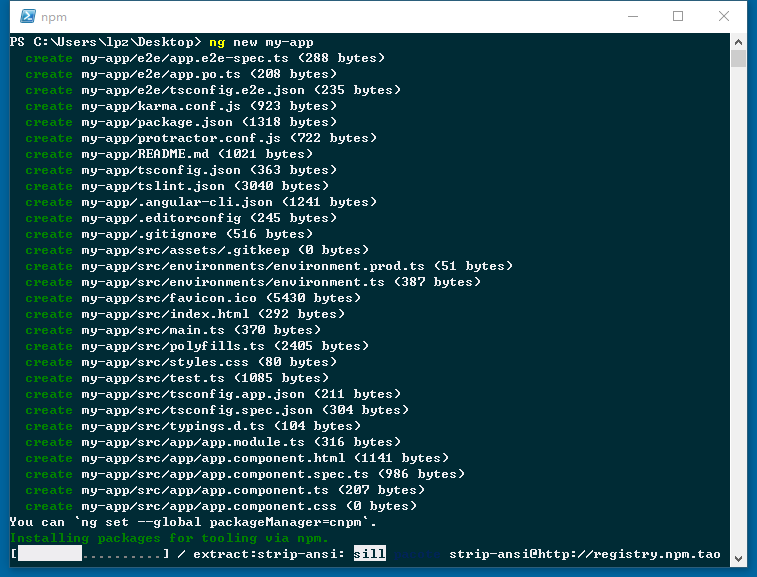
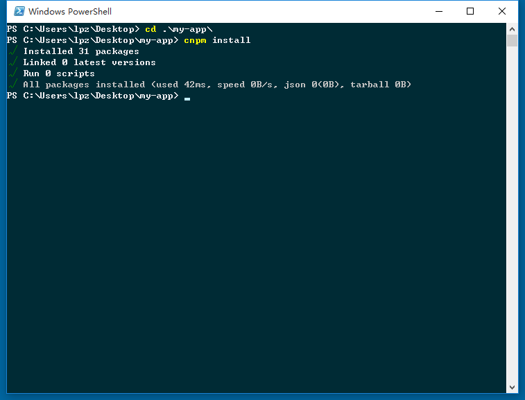
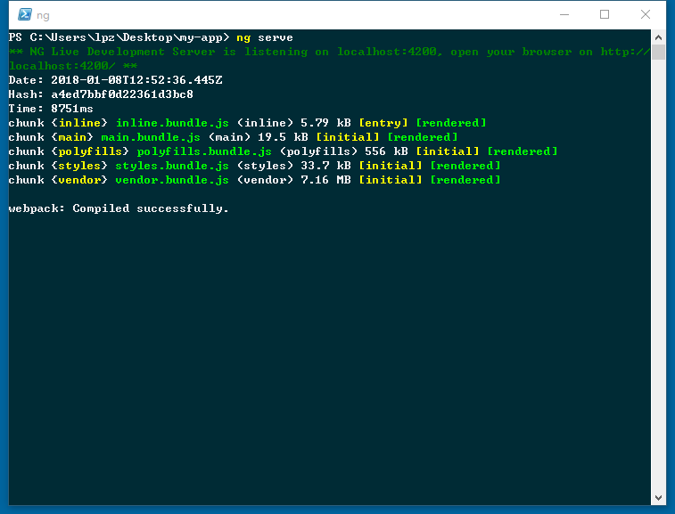
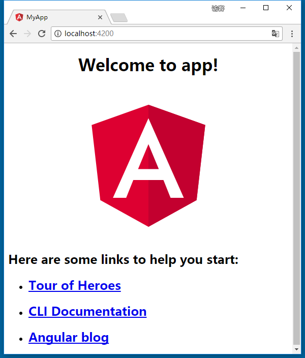
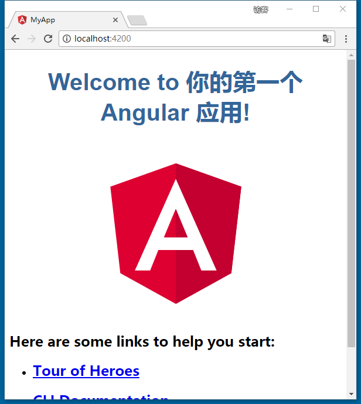

> 内容纲要
>   - 安装 Angular CLI 开发工具
>   - 使用 Angular CLI 初始化 Angular 项目
>   - 简单体验 Angular


目前，无论你使用什么前端框架，都必然要使用到各种 NodeJS 工具，Angular 也不例外。与其它框架不同，Angular 从一开始就走的“全家桶”式的设计思路，因此 @angular/cli 这款工具里面集成了日常开发需要使用的所有 Node 模块，使用 @angular/cli 可以大幅度降低搭建开发环境的难度。

Angular CLI 类似于 Vue CLI，是 Angular 官方开发的一个脚手架工具，专门用来开发构建 Angular 应用程序。

- Angular 应用程序初始化
- 内置开发服务器
- 代码变更浏览器自动刷新
- 创建组件、指令、服务等集成工具
- 测试和维护
- ......

## Step 0. 安装依赖环境

### 安装 Node.js

- 下载地址：https://nodejs.org/en/download/
- 安装
- 确认 Node.js 环境

### 安装 npm

- npm 会随着 Node 的安装被一起安装
- 确认 npm 环境

### 安装 Python

- 下载地址：https://www.python.org/downloads/release/python-2714/
- Windows 32 位：https://www.python.org/ftp/python/2.7.14/python-2.7.14.msi
- Windows 64位：https://www.python.org/ftp/python/2.7.14/python-2.7.14.amd64.msi
- 确认 Python 环境

### 安装 C++ 编译工具

`Angular CLi` 在 Windows 上同时依赖 C++ 编译工具，所以我们这里也需要单独安装。

当然如果你的机器安装了 Visual Studio（注意，不是 Visual Studio Code）。

执行下面的命名安装 C++ 编译工具：

```shell
npm install --global --production windows-build-tools
```

> 💡注意： Windows Vista / 7 依赖  [.NET Framework 4.5.1](http://www.microsoft.com/en-us/download/details.aspx?id=40773) 


### 安装 `cnpm`

```shell
npm i -g cnpm --registry=https://registry.npm.taobao.org
```


## Step1. 安装脚手架工具 `Angular CLI`

[Angular CLI](https://cli.angular.io/) 是 Angular 官方开发的一个类似于 `Vue CLI` 的脚手架开发工具，它帮我们集成了 webpack 打包、开发服务器、单元测试、自动编译、部署等功能特性。

使用它的第一步就是先安装：

```bash
cnpm i -g @angular/cli
```

安装结束之后我们可以通过在命令行输入以下命令测试是否安装成功：

```shell
ng --version
```

```
    _                      _                 ____ _     ___
   / \   _ __   __ _ _   _| | __ _ _ __     / ___| |   |_ _|
  / △ \ | '_ \ / _` | | | | |/ _` | '__|   | |   | |    | |
 / ___ \| | | | (_| | |_| | | (_| | |      | |___| |___ | |
/_/   \_\_| |_|\__, |\__,_|_|\__,_|_|       \____|_____|___|
               |___/

Angular CLI: 1.6.3
Node: 8.9.4
OS: win32 x64
Angular:
...
```


### 安装失败解决方案

- 在 Windows 平台上安装 @angular/cli 会报很多 error，那是因为 @angular/cli 在 Windows 平台上面依赖 Python 和 Visual Studio 环境，而很多开发者的机器上并没有安装这些东西
- 以及 node-sass 模块被墙的问题，强烈推荐使用 cnpm 进行安装，可以非常有效地避免撞墙

```shell
npm i -g cnpm --registry=https://registry.npm.taobao.org

cnpm i -g @angular/cli
```

- 如果安装失败，请手动把全局的 `@angular/cli` 删掉： `cnpm uninstall -g @angular/cli`
- 如果 `node_modules` 删不掉，爆出路径过长之类的错误，请尝试用一些文件粉碎机之类的工具强行删除。
- 无论你用什么开发环境，安装的过程中请仔细看错误日志。很多同学没有看错误日志的习惯，报错的时候直接懵掉，根本不知道发生了什么。

## Setp 2. 使用脚手架工具初始化项目

```shell
ng new my-app
```

`Angular CLI` 将会自动帮你把目录结构创建好，并且会自动生成一些目录文件，就像这样：




**请特别注意：**`Angular CLI` 在自动生成好项目骨架之后，会立即自动使用 npm 来安装所依赖的 Node 模块，所以这里你懂的，一道墙又会阻止我们通往自由的道路，所以这里如果初始化很慢或者失败，请自己手动 `Ctrl + C` 终止掉，然后进入初始化好的项目根目录使用 `cnpm` 来安装。



## Step 3. Serve the application

使用脚手架工具初始化项目完成之后，我们就可以启动开发模式了：

```shell
# 或者 npm start
ng serve
```

**注意：**
1. 在项目根目录下执行
2. 看好是 `serve ` 不是 server
3. 该命令默认会开启一个服务占用 4200 端口，如果想要修改可以通过 `--port` 参数来指定，例如 `ng serve --port 3000`



接下来我们打开浏览器，访问：http://localhost:4200/ 。成功即可在浏览器中看到如下页面：



## Step 4. 体验一下 Angular

找到 `./src/app/app.component.ts` 文件，将 `AppComponent` 组件类中的 `title` 修改如下（记得保存哦）：

```javascript
export class AppComponent {
  title = '你的第一个 Angular 应用';
}
```

你会发现浏览器随之刷新：


标题样式太丑了，来让我们打开 `src/app/app.component.css` 文件并写入以下内容：

```css
h1 {
  color: #369;
  font-family: Arial, Helvetica, sans-serif;
  font-size: 250%;
}
```

现在浏览器随之刷新变为了这样：



是不是很酷！😂😂😂😂😂😂

## 一些常见的坑

@angular/cli 这种“全家桶”式的设计带来了很大的方便，同时也有一些人不太喜欢，因为很多底层的东西被屏蔽掉了，开发者不能天马行空地自由发挥。比如：@angular/cli 把底层 webpack 的配置文件屏蔽掉了，很多喜欢自己手动配 webpack 的开发者就感到很不爽。

对于国内的开发者来说，上面这些其实不是最重要的，国内开发者碰到的坑主要是由两点引起的：

1. 第一点是网络问题：比如 `node-sass` 这个模块你很有可能就装不上，原因你懂的。
2. 第二点是开发环境导致的问题：国内使用 Windows 平台的开发者比例依然巨大，而 @angular/cli 在 Windows 平台上有一些非常恶心的依赖，比如它需要依赖 python 环境、Visual Studio 环境。

所以，如果你的开发平台是 Windows，请特别注意：

1. 如果你知道如何给 npm 配置代理，也知道如何翻墙，请首选 npm 来安装 @angular/cli。
2. 否则，请使用 cnpm 来安装 @angular/cli，原因有三：1、cnpm 的缓存服务器在国内，你装东西的速度会快很多；2、用 cnpm 可以帮你避开某些模块装不上的问题，因为它在服务器上面做了缓存；3、cnpm 还把一些包都预编译好了缓存在服务端，不需要把源码下载到你本地去编译，所以你的机器上可以没有那一大堆麻烦的环境。
3. 如果安装失败，请手动把 node_modules 目录删掉重试一遍，全局的 @angular/cli 也需要删掉重装，cnpm uninstall -g @angular/cli。
4. 如果 node_modules 删不掉，爆出路径过长之类的错误，请尝试用一些文件粉碎机之类的工具强行删除。
5. 无论你用什么开发环境，安装的过程中请仔细看 log。很多朋友没有看 log 的习惯，报错的时候直接懵掉，根本不知道发生了什么。


## 关于编辑器的选择

如你所知，一直以来，前端开发领域并没有一款特别好用的开发和调试工具。

- WebStorm 很强大，但是吃资源很严重。
- Sublime Text 插件很多，可惜要收费，而国内的企业还没有养成花钱购买开发工具的习惯。
- Chrome 的开发者工具很好用，但是要直接调试 TypeScript 很麻烦。

所以，Visual Studio Code（简称 VS Code）才会呈现出爆炸性增长的趋势。它是微软开发的一款编辑器，完全[开源免费](https://github.com/Microsoft/vscode)。VS Code 底层是 Electron，界面本身是用 TypeScript 开发的。对于 Angular 开发者来说，当然要强烈推荐 VS Code。最值得一提的是，从1.14开始，可以直接在 VS Code 里面调试 TypeScript 代码。

## 小结
