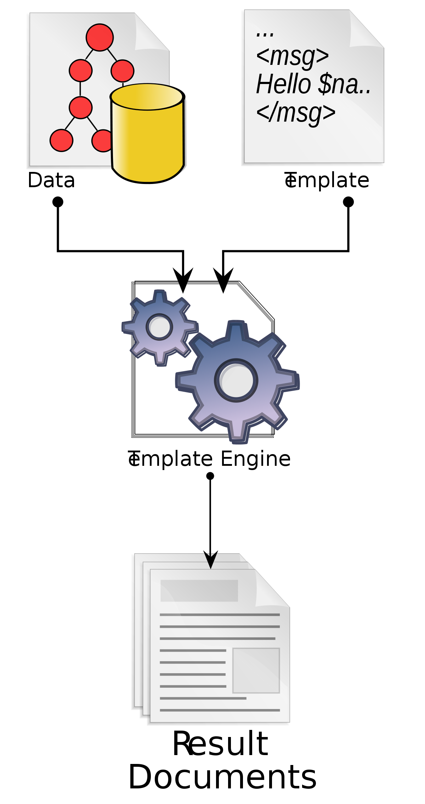

## 插值

### 文本绑定

```html
<p>Message: {{ msg }}</p>

<p [innerHTML]="msg"></p>
```

### 属性绑定

```html
<!-- 写法一 -->


<!-- 写法二，推荐 -->


<!-- 写法三 -->

```

在布尔特性的情况下，它们的存在即暗示为 `true`，属性绑定工作起来略有不同，在这个例子中：

```html
<button [disabled]="isButtonDisabled">Button</button>
```

如果 `isButtonDisabled` 的值是 `null`、`undefined` 或 `false`，则 `disabled` 特性甚至不会被包含在渲染出来的 `<button>` 元素中。

### 使用 JavaScript 表达式

```html
<p>1 + 1 = {{ 1 + 1 }}</p>
<p>{{ num + 1 }}</p>
<p>{{ isDone ? '完了' : '没完' }}</p>
<p>{{ title.split('').reverse().join('') }}</p>

<p [title]="title.split('').reverse().join('')">{{ title }}</p>

<ul>
  <li [id]="'list-' + t.id" *ngFor="let t of todos">
    {{ t.title }}
  </li>
</ul>
```

编写模板表达式所用的语言看起来很像 JavaScript。 很多 JavaScript 表达式也是合法的模板表达式，但不是全部。

Angular 遵循轻逻辑的设计思路，所以在模板引擎中不能编写非常复杂的 JavaScript 表达式，这里有一些约定：

- 赋值 (`=`, `+=`, `-=`, ...)
- `new` 运算符
- 使用 `;` 或 `,` 的链式表达式
- 自增或自减操作符 (`++`和`--`)

## 列表渲染

基本用法：

```typescript
export class AppComponent {
  heroes = ['Windstorm', 'Bombasto', 'Magneta', 'Tornado'];
}
```

```html
<p>Heroes:</p>
<ul>
  <li *ngFor="let hero of heroes">
    {{ hero }}
  </li>
</ul>
```

也可以获取 index 索引：

```html
<div *ngFor="let hero of heroes; let i=index">{{i + 1}} - {{hero.name}}</div>
```


## 条件渲染

### NgIf

```html
<p *ngIf="heroes.length > 3">There are many heroes!</p>
```

#### `ngIf` 和 `<ng-template>`

```html
<ng-template [ngIf]="condition"><div>...</div></ng-template>
```

### NgSwitch

NgSwitch 的语法比较啰嗦，使用频率小一些。

```html
<div [ngSwitch]="currentHero.emotion">
  <app-happy-hero    *ngSwitchCase="'happy'"    [hero]="currentHero"></app-happy-hero>
  <app-sad-hero      *ngSwitchCase="'sad'"      [hero]="currentHero"></app-sad-hero>
  <app-confused-hero *ngSwitchCase="'confused'" [hero]="currentHero"></app-confused-hero>
  <app-unknown-hero  *ngSwitchDefault           [hero]="currentHero"></app-unknown-hero>
</div>
```


## 事件处理

事件绑定只需要用圆括号把事件名包起来即可：

```html
<button (click)="onSave()">Save</button>
```

可以把事件对象传递到事件处理函数中：

```html
<button (click)="onSave($event)">On Save</button>
```

也可以传递额外的参数（取决于你的业务）：

```html
<button (click)="onSave($event, 123)">On Save</button>
```

当事件处理语句比较简单的时候，我们可以内联事件处理语句：

```html
<button (click)="message = '哈哈哈'">内联事件处理</button>
```

我们可以利用 **属性绑定 + 事件处理** 的方式实现表单文本框双向绑定：

```html
<input [value]="message"
       (input)="message=$event.target.value" >
```

事件绑定的另一种写法，使用 `on-` 前缀的方式：

```html
<!-- 绑定事件处理函数 -->
<button on-click="onSave()">On Save</button>
```


## 表单输入绑定

### 文本

```html
<p>{{ message }}</p>
<input type="text" [(ngModel)]="message">
```

运行之后你会发现报错了，原因是使用 `ngModel` 必须导入 `FormsModule` 并把它添加到 Angular 模块的 `imports` 列表中。

导入 `FormsModule` 并让 `[(ngModel)]` 可用的代码如下：

```typescript
import { BrowserModule } from '@angular/platform-browser';
import { NgModule } from '@angular/core';
+++ import { FormsModule } from '@angular/forms';

import { AppComponent } from './app.component';

@NgModule({
  declarations: [
    AppComponent
  ],
  imports: [
    BrowserModule,
+++ FormsModule
  ],
  providers: [],
  bootstrap: [AppComponent]
})
export class AppModule { }

```

通过以上的配置之后，你就可以开心的在 Angular 中使用双向数据绑定了😊。

### 多行文本

```html
<textarea cols="30" rows="10" [(ngModel)]="message"></textarea>
```

### 复选框

```html
<h3>单选框</h3>
<input type="checkbox" [(ngModel)]="seen">
<div class="box" *ngIf="seen"></div>
```

###单选按钮

```html
<input type="radio" [value]="0" [(ngModel)]="gender"> 男
<input type="radio" [value]="1" [(ngModel)]="gender"> 女
<p>选中了：{{ gender }}</p>
```

###下拉列表 

```html
<select [(ngModel)]="hobby">
  <option [value]="0">吃饭</option>
  <option [value]="1">睡觉</option>
  <option [value]="2">打豆豆</option>
</select>
<p>选中的爱好：{{ hobby }}</p>
```

## Class 与 Style 绑定

### Class

- https://angular.io/guide/template-syntax#ngClass

```html
<!-- standard class attribute setting  -->
<div class="bad curly special">Bad curly special</div>

<!-- reset/override all class names with a binding  -->
<div class="bad curly special"
     [class]="badCurly">Bad curly</div>

<!-- toggle the "special" class on/off with a property -->
<div [class.special]="isSpecial">The class binding is special</div>

<!-- binding to `class.special` trumps the class attribute -->
<div class="special"
     [class.special]="!isSpecial">This one is not so special</div>
```

### NgClass 指令

`NgClass` 指令接收一个对象，对象的 `key` 指定 css 类名，value 给定一个布尔值，当布尔值为真则作用该类名，当布尔值为假则移除给类名。

语法规则：

```html
<div [ngClass]="{
  css类名: 布尔值,
  css类名: 布尔值
}">测试文本</div>
```

基本示例：

```css
.saveable{
    font-size: 18px;
} 
.modified {
    font-weight: bold;
}
.special{
    background-color: #ff3300;
}
```

```typescript
currentClasses: {};
setCurrentClasses() {
  // CSS classes: added/removed per current state of component properties
  this.currentClasses =  {
    'saveable': this.canSave,
    'modified': !this.isUnchanged,
    'special':  this.isSpecial
  };
}
```

```html
<div [ngClass]="currentClasses">This div is initially saveable, unchanged, and special</div>
```


### Style

通过**样式绑定**，可以设置内联样式。

样式绑定的语法与属性绑定类似。 但方括号中的部分不是元素的属性名，而由**style**前缀，一个点 (`.`)和 CSS 样式的属性名组成。 形如：`[style.style-property]`。

```html
<button [style.color]="isSpecial ? 'red': 'green'">Red</button>
<!-- 也可以 backgroundColor -->
<button [style.background-color]="canSave ? 'cyan': 'grey'" >Save</button>
```

有些样式绑定中的样式带有单位。在这里，以根据条件用 “em” 和 “%” 来设置字体大小的单位。

```html
<button [style.font-size.em]="isSpecial ? 3 : 1" >Big</button>
<button [style.font-size.%]="!isSpecial ? 150 : 50" >Small</button>
```

> 提示：*样式属性*命名方法可以用[中线命名法](https://angular.cn/guide/glossary#dash-case)，像上面的一样 也可以用[驼峰式命名法](https://angular.cn/guide/glossary#camelcase)，如`fontSize`。

### NgStyle 指令

虽然这是设置单一样式的好办法，但我们通常更喜欢使用 [NgStyle指令](https://angular.cn/guide/template-syntax#ngStyle) 来同时设置多个内联样式。

```typescript
currentStyles: {};
setCurrentStyles() {
  // CSS styles: set per current state of component properties
  this.currentStyles = {
    'font-style':  this.canSave      ? 'italic' : 'normal',
    'font-weight': !this.isUnchanged ? 'bold'   : 'normal',
    'font-size':   this.isSpecial    ? '24px'   : '12px'
  };
}
```

```html
<div [ngStyle]="currentStyles">
  This div is initially italic, normal weight, and extra large (24px).
</div>
```

ngStyle 这种方式相当于在代码里面写 CSS 样式，比较丑陋，违反了注意点分离的原则，而且将来不太好修改，非常不建议这样写（足够简单的情况除外）。

## Angular 中的计算属性

## 模板引用变量

**模板引用变量**通常用来引用模板中的某个DOM元素，它还可以引用Angular组件或指令或[Web Component](https://developer.mozilla.org/en-US/docs/Web/Web_Components)。


使用井号 (#) 来声明引用变量。 `#phone`的意思就是声明一个名叫`phone`的变量来引用`<input>`元素。

```html
<input #phone placeholder="phone number">
```

我们可以在模板中的任何地方引用模板引用变量。 比如声明在`<input>`上的`phone`变量就是在模板另一侧的`<button>`上使用的。

```html
<input #phone placeholder="phone number">

<!-- lots of other elements -->

<!-- phone refers to the input element; pass its `value` to an event handler -->
<button (click)="callPhone(phone.value)">Call</button>
```

> 大多数情况下，Angular会把模板引用变量的值设置为声明它的那个元素。在上面例子中，`phone` 引用的是表示*电话号码*的`<input>`框。 "拨号"按钮的点击事件处理器把这个*input*值传给了组件的`callPhone`方法。 不过，指令也可以修改这种行为，让这个值引用到别处，比如它自身。 `NgForm`指令就是这么做的。


模板引用变量使用注意：

- 模板引用变量的作用范围是*整个模板*。 不要在同一个模板中多次定义同一个变量名，否则它在运行期间的值是无法确定的。
- 如果我在模板里面定义的局部变量和组件内部的属性重名会怎么样呢
  - 如果真的出现了重名，Angular 会按照以下优先级来进行处理
  - `模板局部变量 > 指令中的同名变量 > 组件中的同名属性`
- 我们也可以用`ref-`前缀代替`#`。 下面的例子中就用把`fax`变量声明成了`ref-fax`而不是`#fax`。

```html
<input ref-fax placeholder="fax number">
<button (click)="callFax(fax.value)">Fax</button>
```

## 过滤器

在 Angular 中，过滤器也叫管道。它最重要的作用就是用来格式化数据的输出。

举个简单例子：

```typescript
public currentTime: Date = new Date();
```

```html
<h1>{{currentTime | date:'yyyy-MM-dd HH:mm:ss'}}</h1>
```

Angular 一共内置了16个过滤器：https://angular.io/api?type=pipe。

在复杂业务场景中，内置的过滤器肯定是不够用的，所有 Angular 也支持自定义过滤器。

管道还有另外一个重要的作用就是做国际化。

## 总结

